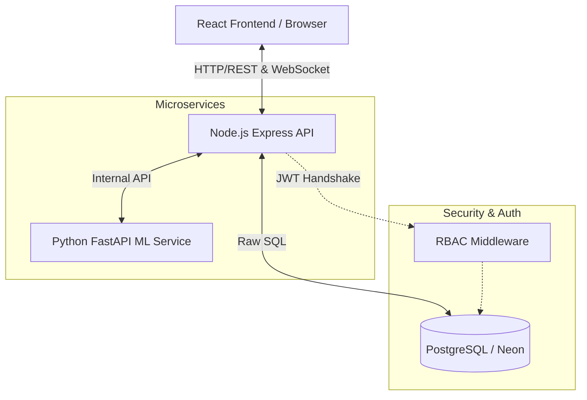

<div align="center">
  
  
  
  
  <h1>🚂 Indian Railways Smart Traffic Management System</h1>
  <p><strong>An enterprise-grade, AI-powered Command & Control System for real-time fleet tracking, delay prediction, and railway network management.</strong></p>
</div>

---

## 🌟 Overview

The Indian Railways Smart Traffic Management System is a highly scalable **Microservice Architecture** designed to handle the complexity of the world's fourth-largest railway network. 

Moving beyond traditional CRUD applications, this platform utilizes **Real-Time WebSockets**, **Machine Learning Prediction Models**, and **Enterprise Role-Based Access Control (RBAC)** to provide a blazing-fast, flicker-free dashboard capable of tracking 10,000+ live trains.

## ✨ Key Features

- **🔴 Real-Time Fleet Tracking:** WebSockets (`Socket.IO`) push live location, speed, and delay updates directly to the client without HTTP polling.
- **🧠 AI Predictive Engine:** A dedicated Python FastAPI microservice calculates predictive delays, station congestion, and maintenance risks based on distance, weather, and real-time density.
- **🛡️ Enterprise RBAC:** Database-level role verification ensures that *Station Masters* only control their designated stations, while *National Controllers* have a macroscopic view.
- **⚡ Zero-Latency UI:** Utilizing React Virtualized Lists and `framer-motion`, the UI renders 50-row paginated data tables at 60FPS with zero layout shift.
- **🌍 Edge-Cached Analytics:** Heavy database aggregate queries are cached at the CDN Edge (`stale-while-revalidate`) for instant dashboard load times under extreme traffic.
- **🏗️ Failsafe Architecture:** If the Python ML microservice goes offline, the Node.js API Gateway automatically initiates deterministic fallback algorithms derived from real-time database density.

---

## 🛠️ Technology Stack

### Frontend (Client-Side)
- **Framework:** React 18 (Vite)
- **State Management:** Zustand (w/ batched Socket.IO queues)
- **Styling & Animation:** TailwindCSS, Framer Motion
- **Routing & SEO:** React Router DOM, React Helmet Async

### Backend API (Node.js Gateway)
- **Runtime:** Node.js / Express
- **Real-Time:** Socket.IO
- **Security:** JWT (JSON Web Tokens), bcryptjs, Helmet
- **Database:** PostgreSQL (Neon Serverless)
- **ORM / Querying:** Raw SQL via `pg` (Optimized Limit/Offset Pagination)

### AI / Machine Learning (Python Service)
- **Framework:** FastAPI
- **Predictions:** Delay, Congestion, Alert Priority, Maintenance Risk

---

## 🏗️ System Architecture



---

## 🚀 Getting Started

### Prerequisites
- Node.js (v18+)
- Python 3.10+
- PostgreSQL Database (Neon.tech recommended)

### 1. Database Setup
Ensure you run the database seeding script to populate the network with test data and users.
```bash
cd backend
npm run seed
```

### 2. Run the Node.js Backend
```bash
cd backend
npm install
npm run dev
```

### 3. Run the ML Service
```bash
cd ai/railways-ml-system/railways-ml-system
pip install -r requirements.txt
uvicorn main:app --reload
```

### 4. Run the Frontend
```bash
cd frontend
npm install
npm run dev
```

---

## 🔐 Test Accounts

Use the following accounts to test the Role-Based Access Control (RBAC):

| Role | Email | Password |
| :--- | :--- | :--- |
| **Admin** | `admin@indianrailways.gov.in` | `password123` |
| **Station Master (HWH)** | `sm_hwh@indianrailways.gov.in` | `password123` |
| **Viewer** | `viewer@indianrailways.gov.in` | `password123` |

---

## 📈 Scalability Highlights
- **O(1) Pagination:** PostgreSQL `LIMIT/OFFSET` keeps memory footprint low regardless of fleet size.
- **Socket Rooms:** Broadcasts are scoped to specific rooms (`station_hwh`, `national`) to prevent network flooding.
- **Client-Side Throttling:** Socket events are queued and flushed every `1000ms` via Zustand to prevent React re-render freezing.

<div align="center">
  <p>Built with ❤️ for Indian Railways Modernization.</p>
</div>
