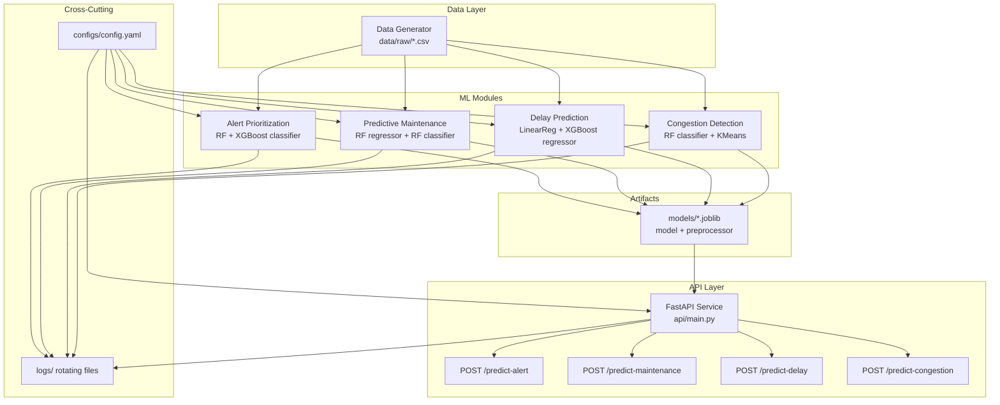

# Design Document: AI-Powered Indian Railways Smart Traffic Management Platform

## Overview

The platform is a Python-based ML system that provides real-time decision support for Indian Railways operations. It consists of four independent ML modules — Alert Prioritization, Predictive Maintenance, Delay Prediction, and Congestion Detection — each following an identical pipeline structure (preprocess → train → predict). A FastAPI service unifies all four modules behind a single REST API. Synthetic data generation bootstraps training without requiring live operational data.

The system is designed for modularity: each module can be trained and run independently, and the API layer loads pre-trained model artifacts at startup. All configuration is externalized to YAML, and all runtime output goes through Python's standard logging framework with rotating file handlers.

---

## Architecture



### Key Architectural Decisions

- Each ML module is self-contained under `src/<module_name>/` with four files: `preprocess.py`, `train.py`, `predict.py`, `utils.py`. This enforces separation of concerns and allows independent development.
- Preprocessor artifacts (scalers, encoders) are saved alongside model artifacts so that training and inference transformations are always in sync.
- The FastAPI service is stateless at the request level — models are loaded once at startup into module-level variables, avoiding per-request I/O.
- A single `configs/config.yaml` drives all tunable parameters (seeds, hyperparameters, paths), making the system configurable without code changes.

---

## Components and Interfaces

### Module Structure (per ML module)

Each of the four modules follows this internal structure:

```
src/<module_name>/
    preprocess.py   # fit_preprocessor(), transform(), load_preprocessor()
    train.py        # train(), evaluate(), save_model()  — entry point when run as script
    predict.py      # load_model(), predict()
    utils.py        # shared helpers: logging setup, config loading, seed setting
```

#### preprocess.py interface

```python
def fit_preprocessor(df: pd.DataFrame, config: dict) -> tuple[Pipeline, pd.DataFrame]:
    """Fit encoders and scalers on training data. Returns (fitted_pipeline, transformed_df)."""

def transform(pipeline: Pipeline, df: pd.DataFrame) -> pd.DataFrame:
    """Apply a fitted preprocessing pipeline to new data."""

def save_preprocessor(pipeline: Pipeline, path: str) -> None:
    """Serialize the fitted pipeline to a .joblib file."""

def load_preprocessor(path: str) -> Pipeline:
    """Deserialize a fitted pipeline from a .joblib file."""
```

#### train.py interface

```python
def train(X_train, y_train, config: dict) -> dict[str, Any]:
    """Train all candidate models. Returns dict of {model_name: fitted_model}."""

def evaluate(models: dict, X_test, y_test) -> dict[str, dict]:
    """Evaluate all models. Returns dict of {model_name: {metric: value}}."""

def save_model(model, path: str) -> None:
    """Save the best model as a .joblib file."""
```

#### predict.py interface

```python
def load_model(path: str) -> Any:
    """Load a .joblib model artifact."""

def predict(model, preprocessor, input_data: dict) -> dict:
    """Preprocess input and return prediction dict."""
```

### FastAPI Service

```
api/
    main.py         # FastAPI app, lifespan handler, route definitions
    schemas.py      # Pydantic request/response models
    dependencies.py # Model/preprocessor loading helpers
```

#### Endpoints

| Method | Path | Request Body | Response |
|--------|------|-------------|----------|
| POST | `/predict-alert` | `AlertRequest` | `{"priority": "Critical\|High\|Medium\|Low"}` |
| POST | `/predict-maintenance` | `MaintenanceRequest` | `{"risk_score": float, "status": "Healthy\|Warning\|Critical"}` |
| POST | `/predict-delay` | `DelayRequest` | `{"delay_minutes": float}` |
| POST | `/predict-congestion` | `CongestionRequest` | `{"congestion_level": "Low\|Medium\|High"}` |

### Data Generator

```
src/data_generator.py   # generate_alert_data(), generate_maintenance_data(),
                        # generate_delay_data(), generate_congestion_data()
```

Each generator function accepts a config dict and returns a `pd.DataFrame`, which is then saved to `data/raw/<module>.csv`.

### Configuration

```
configs/config.yaml
```

Top-level keys: `random_seed`, `data`, `models`, `paths`, `logging`. Each ML module has a sub-key under `models` containing its hyperparameters.

### Logging

A shared `setup_logger(name, config)` utility (in `src/utils.py`) creates a logger with:
- `StreamHandler` for console output
- `RotatingFileHandler` writing to `logs/<name>.log` (max 10 MB, 5 backups)

---

## Data Models

### Pydantic Request Schemas

```python
class AlertRequest(BaseModel):
    alert_type: str          # categorical: e.g. "signal_failure", "track_fault"
    delay_impact: float      # minutes of expected delay impact
    safety_risk: float       # 0.0–1.0 normalized risk score
    affected_trains: int     # count of trains affected
    route_busy: int          # 0 or 1 binary flag
    peak_hour: int           # 0 or 1 binary flag

class MaintenanceRequest(BaseModel):
    temperature: float       # degrees Celsius
    vibration: float         # mm/s
    usage_hours: float       # cumulative operating hours
    last_service_days: int   # days since last service
    fault_history: int       # count of prior faults

class DelayRequest(BaseModel):
    distance: float          # km
    weather: str             # categorical: "clear", "rain", "fog", "storm"
    congestion_level: str    # categorical: "Low", "Medium", "High"
    previous_delay: float    # minutes
    train_type: str          # categorical: "express", "passenger", "freight"

class CongestionRequest(BaseModel):
    train_density: float     # trains per hour on route
    station_load: float      # passengers per hour at station
    time_of_day: str         # categorical: "morning", "afternoon", "evening", "night"
    route_type: str          # categorical: "urban", "suburban", "intercity"
```

### Pydantic Response Schemas

```python
class AlertResponse(BaseModel):
    priority: Literal["Critical", "High", "Medium", "Low"]

class MaintenanceResponse(BaseModel):
    risk_score: float        # [0, 100]
    status: Literal["Healthy", "Warning", "Critical"]

class DelayResponse(BaseModel):
    delay_minutes: float     # >= 0

class CongestionResponse(BaseModel):
    congestion_level: Literal["Low", "Medium", "High"]
```

### Synthetic Dataset Schemas

Each dataset is a CSV with the following columns:

| Module | Feature Columns | Target Column(s) |
|--------|----------------|-----------------|
| Alert | alert_type, delay_impact, safety_risk, affected_trains, route_busy, peak_hour | priority |
| Maintenance | temperature, vibration, usage_hours, last_service_days, fault_history | risk_score, status |
| Delay | distance, weather, congestion_level, previous_delay, train_type | delay_minutes |
| Congestion | train_density, station_load, time_of_day, route_type | congestion_level |

### Model Artifact Naming Convention

```
models/
    alert_prioritization_model.joblib
    alert_prioritization_preprocessor.joblib
    maintenance_regressor.joblib
    maintenance_classifier.joblib
    maintenance_preprocessor.joblib
    delay_prediction_model.joblib
    delay_prediction_preprocessor.joblib
    congestion_detection_model.joblib
    congestion_detection_preprocessor.joblib
```

### Configuration Schema (config.yaml)

```yaml
random_seed: 42

data:
  alert: data/raw/alert_data.csv
  maintenance: data/raw/maintenance_data.csv
  delay: data/raw/delay_data.csv
  congestion: data/raw/congestion_data.csv
  n_samples: 4000

models:
  alert:
    rf_n_estimators: 100
    xgb_n_estimators: 100
    test_size: 0.2
  maintenance:
    rf_n_estimators: 100
    test_size: 0.2
  delay:
    xgb_n_estimators: 100
    test_size: 0.2
  congestion:
    rf_n_estimators: 100
    kmeans_n_clusters: 3
    test_size: 0.2

paths:
  models: models/
  logs: logs/

logging:
  level: INFO
  max_bytes: 10485760
  backup_count: 5
```


## Correctness Properties

*A property is a characteristic or behavior that should hold true across all valid executions of a system — essentially, a formal statement about what the system should do. Properties serve as the bridge between human-readable specifications and machine-verifiable correctness guarantees.*

### Property 1: Alert priority label validity

*For any* valid alert input, the Alert_Prioritizer must return a label that is exactly one of: "Critical", "High", "Medium", or "Low" — never any other string, null, or numeric value.

**Validates: Requirements 2.2**

---

### Property 2: Congestion level label validity

*For any* valid congestion input, the Congestion_Detector must return a label that is exactly one of: "Low", "Medium", or "High".

**Validates: Requirements 5.2**

---

### Property 3: Maintenance status label validity

*For any* valid maintenance input, the Maintenance_Predictor must return a status that is exactly one of: "Healthy", "Warning", or "Critical".

**Validates: Requirements 3.3**

---

### Property 4: Risk score range invariant

*For any* valid maintenance input, the predicted `risk_score` must satisfy `0.0 <= risk_score <= 100.0`.

**Validates: Requirements 3.2**

---

### Property 5: Delay non-negativity invariant

*For any* valid delay prediction input, the predicted `delay_minutes` must satisfy `delay_minutes >= 0.0`. A train cannot have a negative delay.

**Validates: Requirements 4.2**

---

### Property 6: Preprocessing round-trip consistency

*For any* module and any valid input record, applying the saved preprocessing pipeline (loaded from disk) to that record must produce the same transformed values as applying the in-memory pipeline fitted during training. That is, `load_preprocessor(path).transform(x) == fitted_pipeline.transform(x)` for all valid `x`.

**Validates: Requirements 2.6, 4.6, 6.1, 6.4**

---

### Property 7: Preprocessing error on unexpected feature values

*For any* input where a feature value is missing or outside the expected domain (e.g., an unknown categorical label), the preprocessing pipeline must raise an exception that identifies the offending field and value — it must never silently produce a transformed output.

**Validates: Requirements 2.7, 6.5**

---

### Property 8: Reproducibility via fixed random seed

*For any* module, running the full training pipeline twice with the same random seed and the same dataset must produce model artifacts that yield identical predictions on the same test inputs. That is, `predict(model_run1, x) == predict(model_run2, x)` for all `x`.

**Validates: Requirements 1.4, 9.1**

---

### Property 9: Class balance in generated datasets

*For any* generated classification dataset (alert, maintenance status, congestion), no single class label should account for more than 60% of all rows. This ensures the synthetic data is not degenerate and supports meaningful model training.

**Validates: Requirements 1.3**

---

### Property 10: API returns HTTP 422 for invalid request bodies

*For any* request to any prediction endpoint where the JSON body is missing a required field or contains a value of the wrong type, the API must respond with HTTP status 422 and a body that describes the validation error.

**Validates: Requirements 7.7**

---

### Property 11: Configuration round-trip

*For any* valid `config.yaml` file, loading it with the config loader and reading a key must return the same value that was written to the file. That is, `load_config(path)[key] == written_value` for all keys present in the file.

**Validates: Requirements 8.4**

---

### Property 12: Missing configuration key raises descriptive error

*For any* config file that is missing a required key, the config loader must raise an error that names the missing key — it must never silently use a default or raise a generic exception.

**Validates: Requirements 8.5**

---

## Error Handling

### Preprocessing Errors

- Missing feature fields: raise `ValueError("Missing required field: <field_name>")` before any transformation.
- Unknown categorical value: raise `ValueError("Unexpected value '<value>' for field '<field_name>'")`.
- Numeric value out of expected range: raise `ValueError("Value <value> for field '<field_name>' is out of expected range [<min>, <max>]")`.

### Model Loading Errors

- Missing `.joblib` artifact at startup: log `ERROR` with the missing path, then raise `FileNotFoundError` to abort startup. The FastAPI lifespan handler catches this and prevents the app from accepting requests.
- Corrupt artifact: `joblib.load` will raise; let it propagate to the lifespan handler.

### API Errors

- Pydantic validation failure: FastAPI handles automatically → HTTP 422 with field-level error detail.
- Unhandled exception in prediction route: global exception handler catches, logs full stack trace at `ERROR` level, returns HTTP 500 with `{"detail": "Internal prediction error"}`.
- Startup failure: logged and re-raised; the process exits non-zero so container orchestrators can detect and restart.

### Configuration Errors

- Missing required key: `KeyError` with message `"Required config key '<key>' not found"` raised before any module processing begins.
- Invalid YAML syntax: `yaml.YAMLError` propagates with the parse error message.

### Training Errors

- Empty or malformed dataset: raise `ValueError` identifying the dataset path and the issue (e.g., missing columns).
- Model training failure (e.g., XGBoost convergence): log `WARNING` with the error, skip that candidate model, and proceed with the remaining model if at least one succeeds.

---

## Testing Strategy

### Dual Testing Approach

Both unit tests and property-based tests are required. They are complementary:
- Unit tests verify specific examples, integration points, and error conditions.
- Property tests verify universal invariants across many generated inputs.

### Unit Tests

Focus areas:
- Data generator: file existence, row count range, column names, CSV readability.
- Preprocessing: correct encoding of known categorical values, correct scaling of known numeric values, error on missing field, error on unknown categorical.
- Training: model artifact file existence after training, metric keys present in evaluation output, best-model selection logic (mock two models with known scores).
- Prediction: correct label type returned, correct response schema.
- API endpoints: HTTP 200 with valid body, HTTP 422 with missing field, HTTP 422 with wrong type, HTTP 500 on mocked model exception, startup failure on missing artifact.
- Config loader: correct value retrieval, `KeyError` on missing key.

### Property-Based Tests

Library: **Hypothesis** (Python). Each test runs a minimum of 100 iterations.

Each property test must be tagged with a comment in the format:
`# Feature: railways-ml-system, Property <N>: <property_text>`

| Property | Test Description |
|----------|-----------------|
| P1 | Generate random AlertRequest instances → assert output in {"Critical","High","Medium","Low"} |
| P2 | Generate random CongestionRequest instances → assert output in {"Low","Medium","High"} |
| P3 | Generate random MaintenanceRequest instances → assert status in {"Healthy","Warning","Critical"} |
| P4 | Generate random MaintenanceRequest instances → assert 0.0 <= risk_score <= 100.0 |
| P5 | Generate random DelayRequest instances → assert delay_minutes >= 0.0 |
| P6 | Generate random valid records → assert load_preprocessor(path).transform(x) == fitted.transform(x) |
| P7 | Generate inputs with missing/invalid fields → assert ValueError raised with field name in message |
| P8 | Run training twice with same seed → assert predictions identical on same test set |
| P9 | Generate dataset → assert no class exceeds 60% of rows |
| P10 | Generate malformed request bodies → assert HTTP 422 response |
| P11 | Generate config dicts → write to YAML → load → assert all values match |
| P12 | Generate config dicts with one key removed → assert KeyError names the missing key |

### Integration Tests

- End-to-end pipeline test per module: generate data → preprocess → train → predict → assert artifact files exist and predictions are valid.
- API startup test: ensure all four endpoints respond to valid requests after loading real model artifacts.

### Test Organization

```
tests/
    unit/
        test_data_generator.py
        test_alert_preprocess.py
        test_maintenance_preprocess.py
        test_delay_preprocess.py
        test_congestion_preprocess.py
        test_alert_train.py
        test_maintenance_train.py
        test_delay_train.py
        test_congestion_train.py
        test_api.py
        test_config.py
    property/
        test_properties.py   # all 12 Hypothesis property tests
    integration/
        test_pipeline_e2e.py
```
